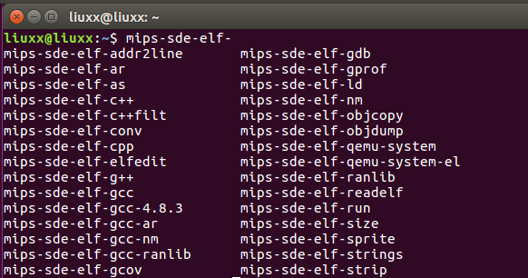
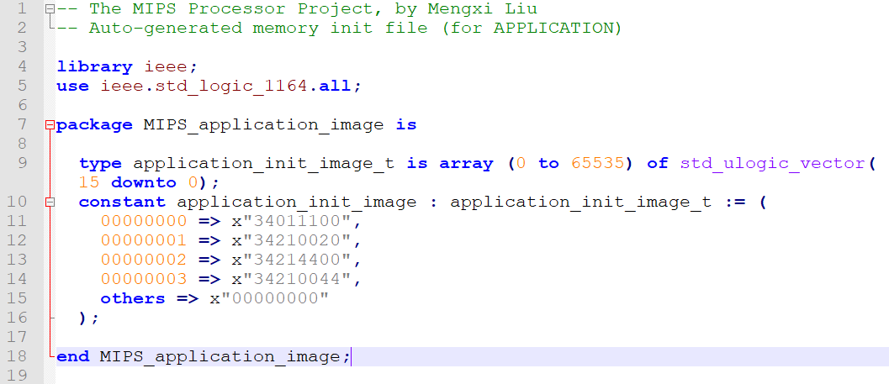

# Design-and-Impelementation-my-own-CPU

The project is based on ncremental development model.

- At rtl4, a primary five-stage pipeline is realized and the first instruction ori is implemented.

- At rtl5, logical and shift instructions are realized, besides, the nop instruction is also realized.

- At rtl6, the move instructions are implemented.

- At rtl7, Arithmetric instruction and pipeline stall are realized.

- At rtl8, jump instruction and delay slot are realized.

- At rtl9, load and store instructions are realized.

## Create Compiler Environment of the MIPS processor

Before designing this processor, I have planed that it should be compatible with the architecture of MIPS32 instrustion set. Therefore, the existing GNU development tool chain under the MIPS32 architecture can be used. To test processor function, a compiler environment should be created at first.

1. Operation System
Ubuntu 16.04

2. Install GNU tool chain
You can download the prebuilt package, unpack it, set your path to it’s top level bin directory and begin to use it. If you unpack the package to a folder different from “/opt“, you will have to manually point to the sysroot folder using “–sysroot” command line option on each gcc invocation.

 - Download this tar file: Mips_linux_toolchain_bin-1.1.tar.bz2(https://www.mips.com/files/mips-linux-toolchain-bin-1-1-tar-bz2/);
 - Unpack the tar file to the /opt folder:
 
        cd /opt
        tar vfxj Mips_linux_toolchain_bin-1.1.tar.bz2
         
 - Add the bin folder to the path:
 Open a hidden file .bash under home folder, add this command:
 
       export PATH=/opt/mips_linux_toolchain/bin:$PATH
     
- Test

Open Terminal, input:

      mips-sde-elf-

Then, double click TAB. If it is installed successfully, then it outputs as following content: 
                
           
 
 Introduction of tool chain:
 
 1. mips-sde-elf-as: it is GNU Assembler (GAS), As compiles the assembly source program to generate the object file.
 2. mips-sde-elf-ld: it is GNU Linker, the object file nueeds to be linked by the linker and relocation data to generate an executable file.
 3. mips-sde-elf-objcopy: it is used to copy the target file in one format to another format.
 4. mips-sde-elf-objdump: print the information of binary files.
 5. mips-sde-elf-readelf: it is similar to objdumpy, but it can only process .elf file.
 
 ## Compiler assembly program by GNU tool chain
 
The program to test the designed processor is writen by assmbly language which is compiled by GAS to generate object file, this file is a relocatable file. It can not be excuted yet. It should be converted into excutable file by Linker. 

1. Compile assembly code

       mips-sde-elf-as -mips32 inst_rom.S -o inst_rom.o
      
2. Link file by GUN tool

As the reloctable file generated by GAS can not be excuted, it need to be converted into excutable file by Linker. 

       mips-sde-elf-ld -T ram.ld inst_rom.o -o inst_rom.om
       
ram.ld is a link description file, it describes how the sections in input file map to the sections in output file.

3. Get ROM file

A excutable file is generated by Linker, but this file can not be directly writen into the instruction ROM. At first I convert into this file inst_rom.om file into inst_rom.bin:

     mips-sde-elf-objcopy -O binary inst_rom.om inst_rom.bin
     
Then I use a c++ script imagine_generate.cpp convert the inst_rom.bin file into a imagine file with VHDL format. At last, the ROM is written by those data in imagine.vhdl during initilization.

Compile C++ script
      
      gcc -o imagine_generate imagine_generate.cpp

generate imgine.vhdl file
 
      ./imagine_generate -app_img inst_rom.bin  imagine.vhdl
      
Finally, the instruction written by assembely language is converted into a vhdl file as followed:

 
     
## Simulation

The simulation tool used in this project is Modelsim. The testbench file name is tb_openmips_min_sopc.vhdl. The arctecture of the mini mips CPU is as the figure shows:

 

 

